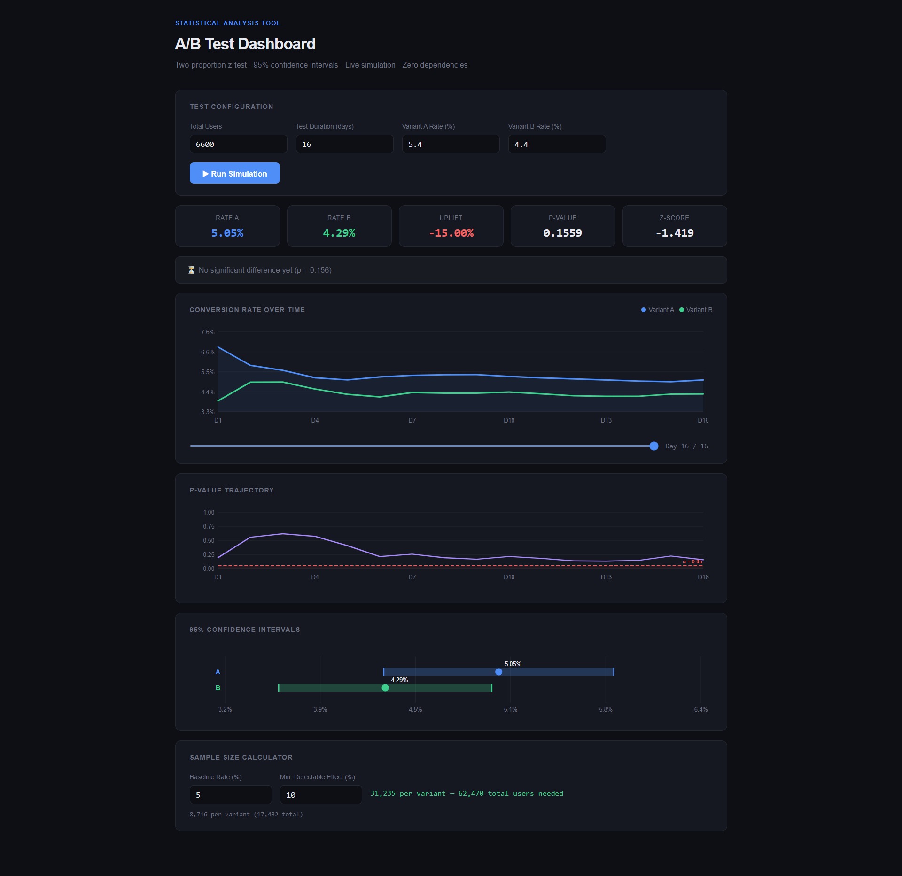

# A/B Testing Dashboard

A statistical A/B testing dashboard built with **TypeScript + Vite**. No UI libraries, no chart libraries — every chart is hand-drawn SVG, every stat computed from scratch.



## What it does

- **Live simulation** of a two-proportion z-test, animated day by day
- **Conversion rate chart** — dual line chart showing both variants over time
- **p-value trajectory** — watch significance emerge (or not) as data accumulates
- **95% Confidence intervals** — visual CI comparison with exact bounds
- **Sample size calculator** — given a baseline rate and MDE, returns required n per variant
- **Verdict card** — plain-English result with significance status

## Stats implemented (zero dependencies)

| Method | Description |
|---|---|
| Two-proportion z-test | Compares conversion rates between A and B |
| Normal CDF (Hart approximation) | p-value computation |
| Wilson CI | 95% confidence interval for proportions |
| Beasley-Springer-Moro | Inverse normal CDF for sample size calc |
| Relative uplift | `(pB - pA) / pA * 100` |
| Sample size formula | `n = 2 * pAvg * (1 - pAvg) * (zα + zβ)² / (pB - pA)²` |

## Stack

- **TypeScript** — strict mode, zero `any`
- **Vite** — dev server + build
- **pnpm** — package manager
- No React, no chart libraries, no CSS frameworks

## Run locally

```bash
pnpm install
pnpm dev
```

Then open `http://localhost:5173`

## Build

```bash
pnpm build
# output in dist/
```

## Project structure

```
ab-testing-dashboard/
├── src/
│   ├── stats.ts     # Statistical engine (z-test, CI, sample size, simulation)
│   ├── charts.ts    # SVG chart renderers (no libraries)
│   └── main.ts      # UI wiring and animation loop
├── index.html
├── tsconfig.json
├── vite.config.ts
└── package.json
```

## Usage

1. Set total users, test duration, and true conversion rates for A and B
2. Click **Run Simulation** — watch the test unfold day by day
3. Scrub the timeline slider to jump to any point
4. Use the sample size calculator to plan your next test
